# 🎮 V-PRO Coupon Manager

 
 
 
 

> **컴투스 프로야구 V25 쿠폰 입력기입니다.**
> 
> "V-PRO 쿠폰 매니저"는 다수의 게임 계정과 쿠폰 코드를 한 번에 관리하고
> 자동으로 등록해주는 데스크탑 애플리케이션입니다.

---

## ✨ 주요 기능 (Key Features)

* **🚀 대량 일괄 처리:** 여러 개의 계정과 쿠폰 코드를 한 번의 클릭으로 모두 적용합니다.
* **👥 계정 관리 (Local DB):** '본계정', '부계정' 등 CS 코드를 별칭과 함께 로컬 데이터베이스에 안전하게 저장합니다.
* **📜 실행 히스토리:** 언제, 어떤 쿠폰이 성공했고 실패했는지 모든 기록을 로그로 남깁니다.
* **👻 백그라운드 모드:** `Headless` 옵션을 지원하여 브라우저 창 없이 조용하게 작업을 수행할 수 있습니다.
* **💻 크로스 플랫폼:** Windows와 macOS 환경을 모두 지원합니다.

---

## 📥 다운로드 및 설치 (Download & Install)

👉 **[최신 버전 다운로드 하러 가기](https://github.com/v-pro-project/coupon-manager/releases)**

최신 버전은 우측의 **[Releases]** 탭에서 다운로드할 수 있습니다.

| OS | 파일명 | 비고 |
| :--- | :--- | :--- |
| **Windows** | `VProCouponManager_Windows.exe` | 설치 없이 실행 가능 |
| **macOS** | `VProCouponManager_Mac.zip` | Apple Silicon(M1/M2) 호환 |

---

## ⚠️ 실행 시 주의사항 (필독)

### 🪟 Windows 사용자

1. 다운로드한 `.zip` 파일(또는 `.exe`)의 압축을 풀고 실행합니다.
2. 실행 시 다음과 같은 화면이 나온다면 **[추가 정보]** 를 클릭합니다.

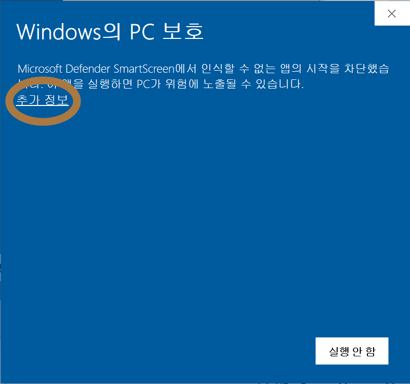

3. 하단에 생기는 **[실행]** 버튼을 클릭해주시면 정상적으로 실행됩니다.

### 🍎 macOS 사용자

1. 다운로드한 `.zip` 파일의 압축을 풉니다.
2. 처음 실행하게 된다면, 다음과 같은 보안 문구가 나옵니다.

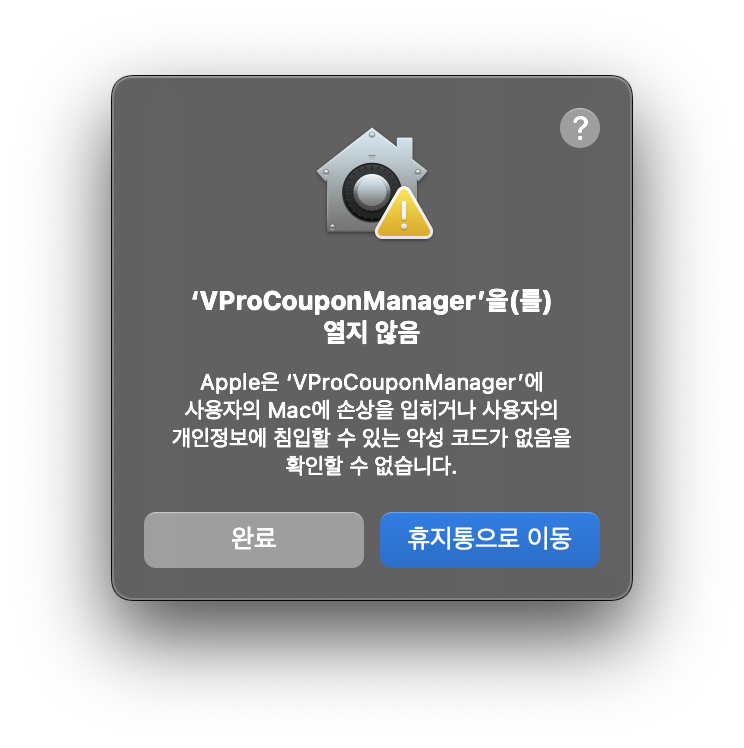

3. 애플의 보안 정책상 바로 실행이 되지 않습니다. **[시스템 설정] -> [개인정보 보호 및 보안]** 메뉴로 이동하여 하단의 **"확인 없이 열기" (또는 그래도 열기)** 를 클릭합니다.

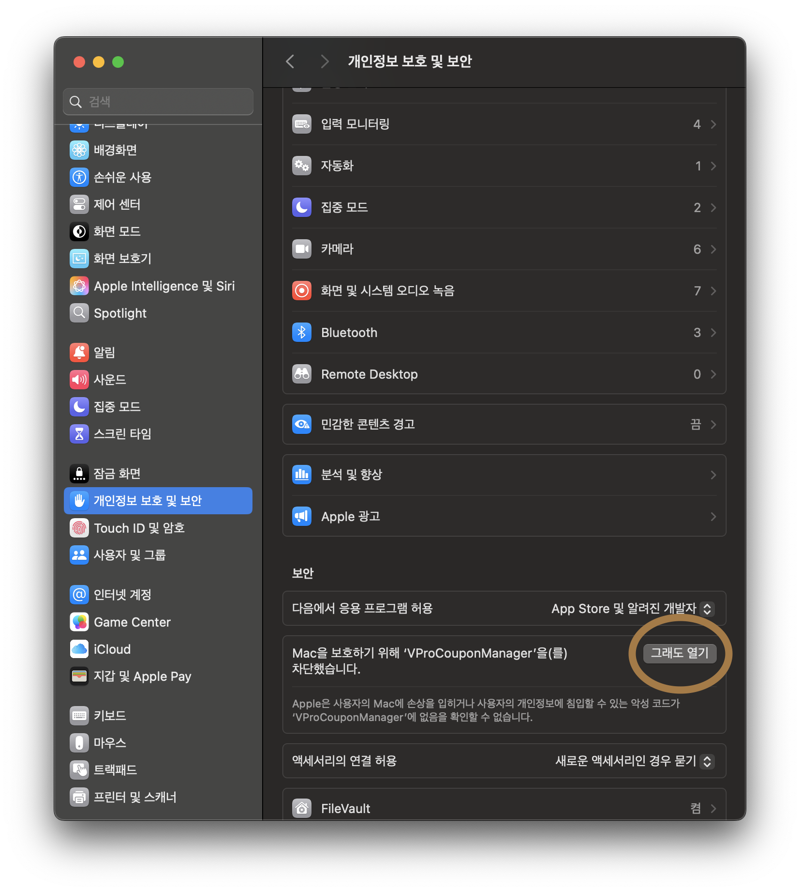

4. 그러면 다음처럼 진짜 열 것인지 다시 한번 물어봅니다. **[열기]** 를 다시 한번 클릭합니다.

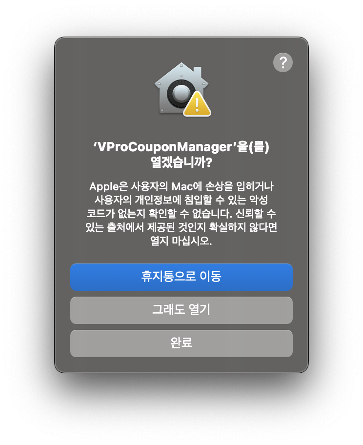

5. 아래와 같이 암호 인증(Touch ID)을 거치면 실행됩니다.

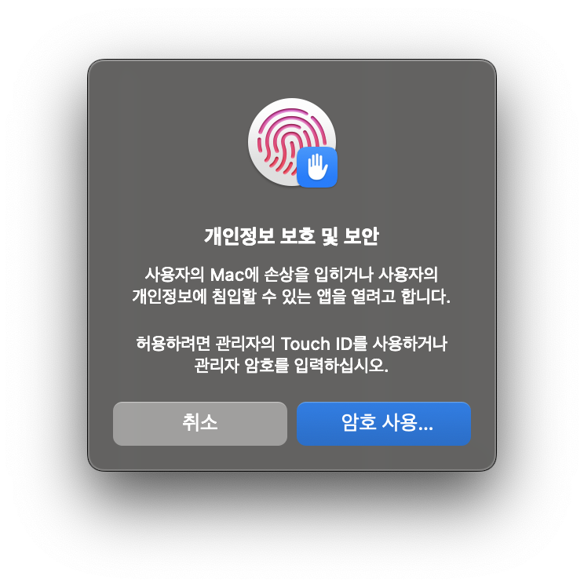

> *주의: 애플 개발자 서명이 포함되지 않은 개인 개발 앱이므로, 그냥 더블 클릭하면 실행이 차단될 수 있습니다. 반드시 최초 1회는 위 과정을 거쳐주세요.*

---

## 📖 사용 가이드 (User Guide)

### 1. 계정(CS Code) 등록하기
저장하고 싶은 게임 계정의 CS 코드를 입력하여 관리할 수 있습니다.

| Windows | macOS |
| :---: | :---: |
| 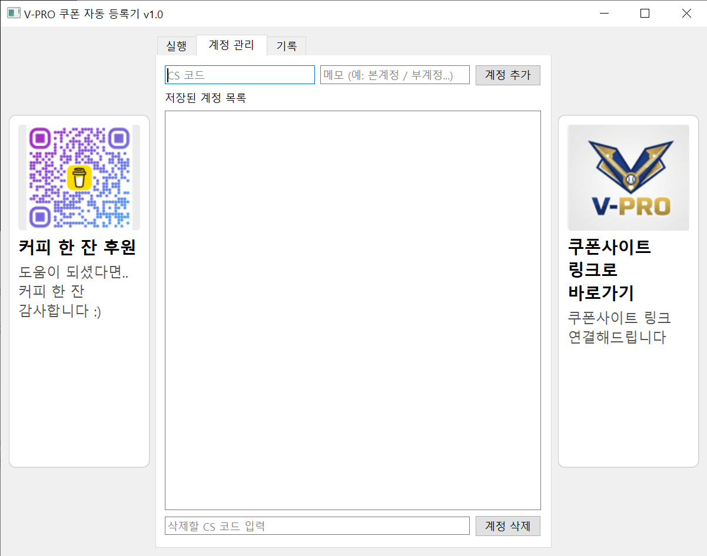 | 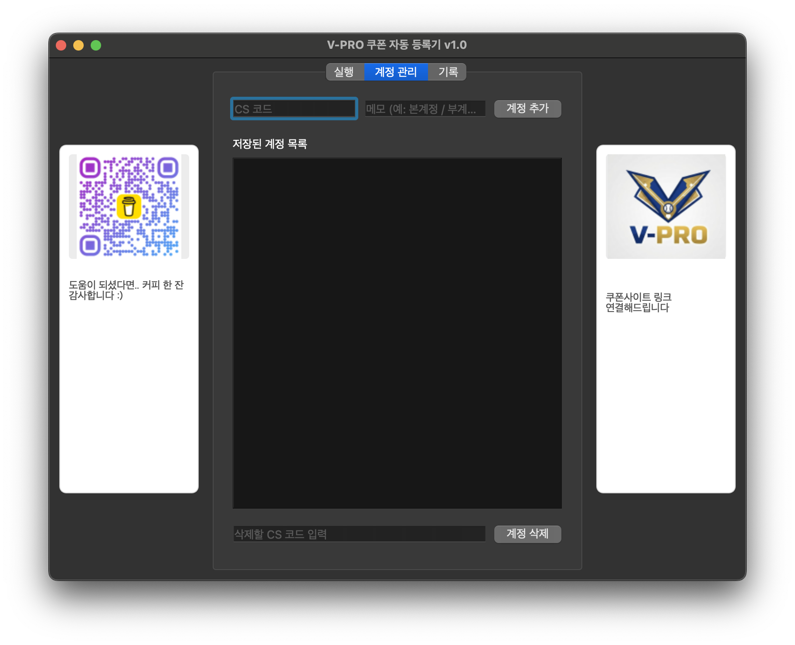 |

1. **[계정 관리]** 탭으로 이동합니다.
2. CS 코드와 메모(예: 본캐)를 입력하고 **[추가]** 버튼을 누릅니다.

### 2. 쿠폰 입력 및 실행
등록된 계정을 불러와 쿠폰을 일괄 적용합니다.

| Windows | macOS |
| :---: | :---: |
| 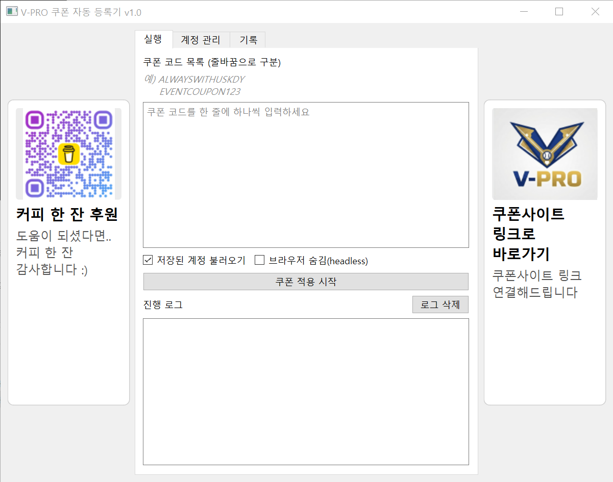 | 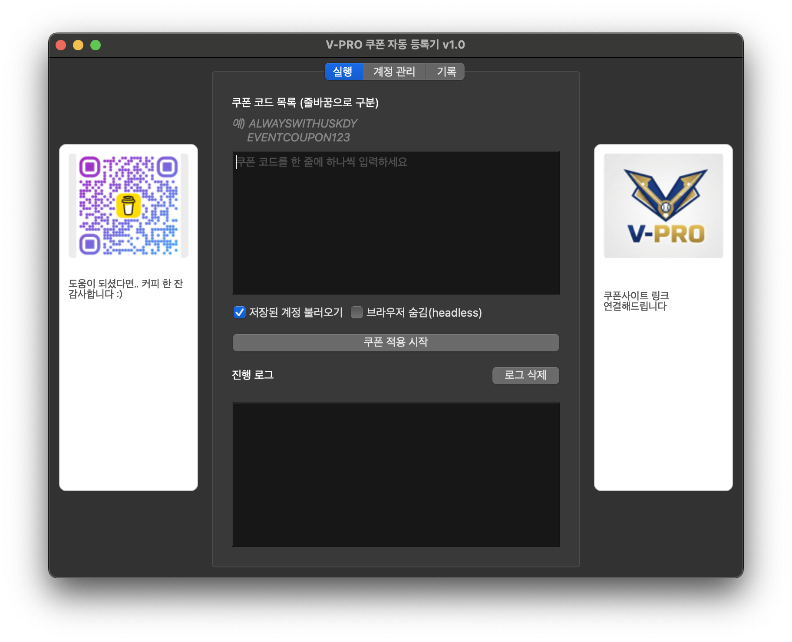 |

1. **[실행]** 탭에서 쿠폰 코드를 입력합니다. (여러 줄 입력 가능)
2. `저장된 계정 사용`을 체크하면 등록해둔 모든 계정이 자동으로 로드됩니다.
3. **[쿠폰 적용 시작]** 버튼을 클릭하면 작업이 시작됩니다.

### 3. 결과 확인
작업이 완료되면 성공/실패 여부를 바로 확인할 수 있습니다.

| Windows | macOS |
| :---: | :---: |
| 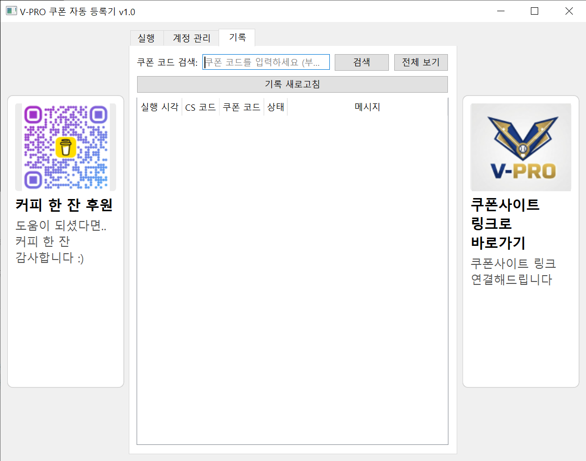 | 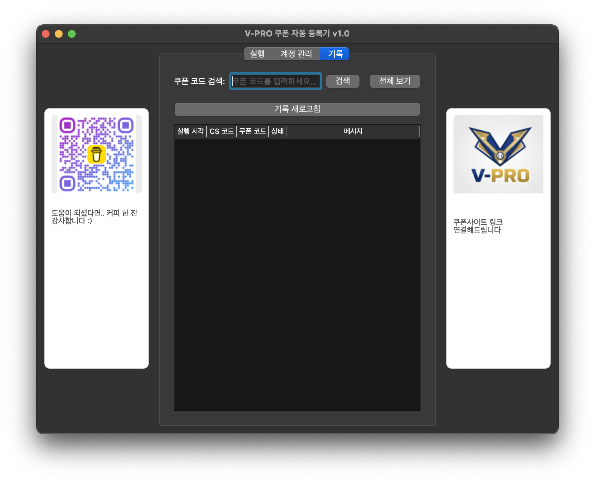 |

---

## 📬 문의 및 피드백 (Contact)

버그 제보나 기능 제안은 [Issues](https://github.com/v-pro-project/coupon-manager/issues) 탭에 남겨주세요. 

* **Repository:** [v-pro-project/coupon-manager](https://github.com/v-pro-project/coupon-manager)
* **Developer:** [Dylan-yoon](https://github.com/Dylan-yoon)

### 💻 개발 환경 및 호환성
* **Mac (M1/M2):** Apple Silicon 환경에서 개발 및 테스트 완료 (정상 작동)
* **Windows 10:** 정상 작동 확인
* *개인 프로젝트 특성상 일부 환경에서 충돌이 발생할 수 있습니다. 버그 및 추가 개선 사항들은 Issues나 메일로 제보해 주시면 감사하겠습니다.*

---
*Disclaimer: 이 프로그램은 개인적인 편의를 위해 제작되었으며, 게임사의 이용 약관을 위반하지 않는 범위 내에서 사용하시기 바랍니다.*
